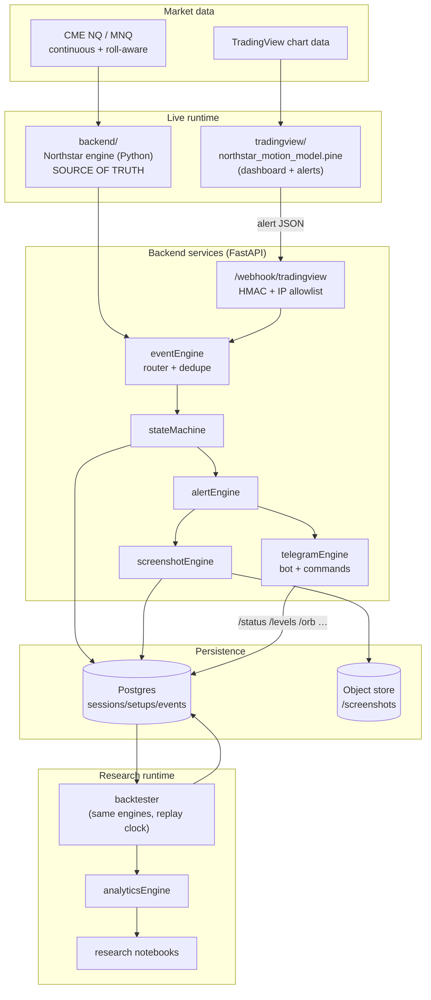
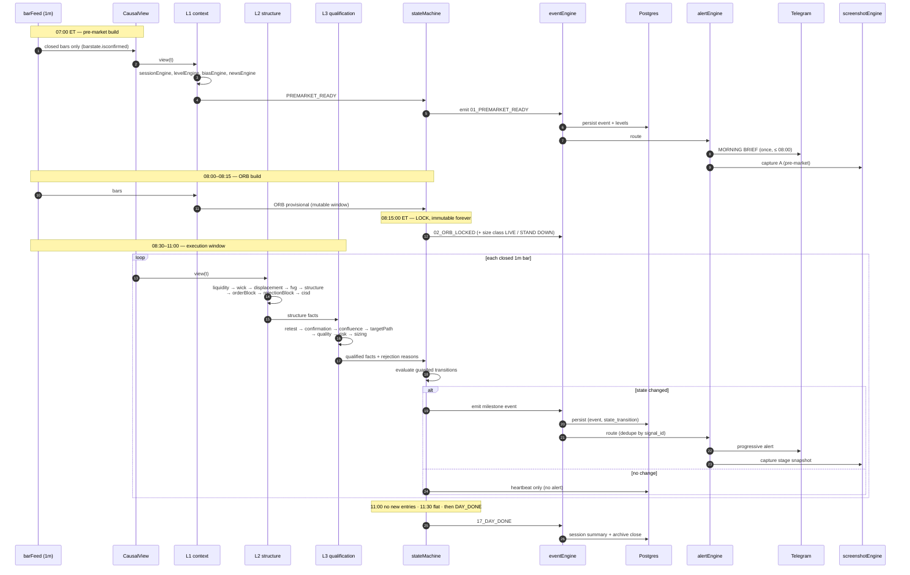
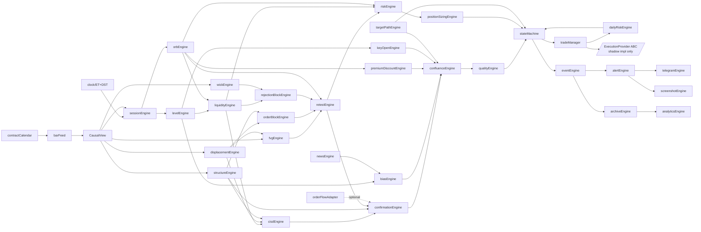

# NORTHSTAR CAPITAL™ — SYSTEM ARCHITECTURE

Deliverables covered: **(1) complete system architecture, (2) data-flow diagram,
(4) module dependency map.**
Status: **PROPOSED — awaiting approval.**

---

## 1. Architectural principles

| # | Principle | Consequence in the design |
|---|---|---|
| P1 | **Single source of truth for logic** | The Python `strategy/` package is authoritative. Pine is a *client*, not a second brain. |
| P2 | **Strict causality** | Every engine is a pure function of `(bars[0..t], levels, config)`. No engine may read index `> t`. Enforced by the `CausalView` API and no-lookahead tests. |
| P3 | **Explainability by construction** | No engine returns a bare boolean. Every result is a typed record carrying `value`, `passed`, `reason`, `inputs_used`, `param_version`. |
| P4 | **Configuration is data, not code** | All thresholds live in a versioned YAML config; each session stores the config hash it ran under. |
| P5 | **Events are immutable facts** | Engines emit events. The state machine consumes events. Nothing mutates a past event. |
| P6 | **Absence is a first-class value** | `UNAVAILABLE` is distinct from `FALSE`. Order flow absent ≠ order flow negative. |
| P7 | **No forced trades** | The default answer is `WAIT`. Every path to `ENTRY_READY` must pass every gate; zero trades is a valid day. |
| P8 | **Reproducibility** | Given `(session_id)` the archive can replay the exact bar stream, config, engine outputs, states, events and decisions. |

---

## 2. Layered architecture

```
┌──────────────────────────────────────────────────────────────────────────┐
│ L6  PRESENTATION                                                         │
│     TradingView dashboard (Pine v6)  ·  Telegram assistant  ·  Research  │
│                                          notebooks · Archive viewer      │
├──────────────────────────────────────────────────────────────────────────┤
│ L5  DELIVERY                                                             │
│     alertEngine · telegramEngine · screenshotEngine · dashboardRenderer  │
├──────────────────────────────────────────────────────────────────────────┤
│ L4  ORCHESTRATION                                                        │
│     stateMachine · eventEngine · tradeManager · dailyRiskEngine          │
│     rejectionEngine (reason ledger) · sessionOrchestrator                │
├──────────────────────────────────────────────────────────────────────────┤
│ L3  QUALIFICATION                                                        │
│     retestEngine · confirmationEngine · confluenceEngine ·               │
│     targetPathEngine · qualityEngine · riskEngine · positionSizingEngine │
├──────────────────────────────────────────────────────────────────────────┤
│ L2  MARKET STRUCTURE                                                     │
│     liquidityEngine · wickEngine · displacementEngine · fvgEngine ·      │
│     structureEngine · orderBlockEngine · rejectionBlockEngine ·          │
│     cisdEngine · biasEngine · premiumDiscountEngine                      │
├──────────────────────────────────────────────────────────────────────────┤
│ L1  CONTEXT                                                              │
│     sessionEngine · orbEngine · levelEngine · newsEngine ·               │
│     orderFlowAdapter (gated, may report UNAVAILABLE)                     │
├──────────────────────────────────────────────────────────────────────────┤
│ L0  DATA                                                                 │
│     barFeed · CausalView · contractCalendar · clock (ET/DST) ·           │
│     persistence (Postgres/SQLite) · objectStore (screenshots)            │
└──────────────────────────────────────────────────────────────────────────┘
```

An engine may only depend on engines in its own layer or below. Any upward
dependency is an architecture bug and is asserted in `tests/test_layering.py`.

---

## 3. Runtime topology

Three runtimes share one definition set.



### 3.1 Why two computation paths exist, and how they are kept honest

Pine cannot be the research engine (no database, no cross-session state, no
statistics) and Python cannot be the chart (no native TradingView rendering).
So both compute the model. That is a genuine architectural risk, and it is
handled explicitly:

**Dual-Runtime Parity contract**

1. Both runtimes read the *same* parameter file. `config/northstar.defaults.yaml`
   is the master; `tradingview/params_generated.pine` is **generated** from it by
   `research/tools/gen_pine_params.py` and is never hand-edited.
2. Pine emits, on every state transition, the full engine vector (scores,
   flags, levels) in the alert payload — not just the headline.
3. `tests/parity/` replays a recorded day through the Python engine and diffs it
   against the captured Pine payloads. Tolerance: exact for booleans and states,
   ±0.01 for prices, ±1 for 0–100 scores.
4. Any parity break is a release blocker.
5. If parity proves unmaintainable in practice, the fallback is **Pine as a pure
   renderer**: Python computes state, pushes it to the chart via an external
   data channel, and Pine only draws. This is recorded as a known escape hatch.

**Declared risk:** parity maintenance is real, recurring work. It is the price
of having both an institutional-grade research stack and a live chart.

---

## 4. Data flow — intraday session



### 4.1 Per-bar evaluation order (fixed, non-negotiable)

The order matters because later engines consume earlier outputs.

```
01 clock/session guard      → is this bar inside a tracked window?
02 levelEngine refresh      → static levels + rolling swing pools
03 liquidityEngine          → pool states: IDENTIFIED/SWEPT/RECLAIMED/FAILED
04 wickEngine               → abnormal wick metrics for this bar
05 displacementEngine       → leg detection + displacementScore
06 fvgEngine                → creation, mitigation %, invalidation
07 structureEngine          → confirmed pivots, BOS/MSS (delayed, no repaint)
08 orderBlockEngine         → depends on 05 + 07
09 rejectionBlockEngine     → depends on 03 + 04
10 cisdEngine               → depends on 03 + 05 + 07
11 biasEngine (refresh)     → bias score decay/update
12 premiumDiscountEngine    → location vs equilibrium
13 retestEngine             → depends on 05..09
14 confirmationEngine       → booleans, no aggregation
15 confluenceEngine         → 0..12 inventory
16 targetPathEngine         → obstruction scan toward TP
17 qualityEngine            → 0..100
18 riskEngine               → stop validity
19 positionSizingEngine     → contracts, actual risk
20 dailyRiskEngine          → governor veto
21 stateMachine             → transition or hold
22 eventEngine              → emit / dedupe / persist
23 alertEngine → telegram/screenshot
```

Every step 03–20 that returns `false` writes a **rejection reason** into the
ledger, even when a later step would have passed. The ledger is why the system
can always answer "what is missing?".

---

## 5. Module dependency map



### 5.1 Module contracts

Each module ships as `strategy/engines/<name>.py` exposing exactly:

```
def evaluate(view: CausalView, ctx: SessionContext, cfg: Config) -> <Result>
```

* `view` — read-only, causal, raises `LookaheadError` on any index > t
* `ctx` — accumulated immutable session facts (ORB, levels, pools, prior events)
* `cfg` — frozen config slice for this engine, carrying `param_version`
* `<Result>` — a frozen dataclass; always includes `reasons: list[Reason]`

No engine performs I/O. No engine reads the clock directly (it reads
`view.now`). No engine mutates `ctx`; the orchestrator folds results into the
next `ctx`. This is what makes replay bit-exact.

---

## 6. Backend service architecture (FastAPI)

```
backend/
  app/
    main.py                 FastAPI app factory, lifespan, health
    routers/
      webhook.py            POST /webhook/tradingview   (HMAC + IP allowlist)
      telegram.py           POST /webhook/telegram      (secret_token header)
      admin.py              GET  /admin/session/{id}, /admin/config (authed)
      health.py             GET  /healthz /readyz /version
    services/
      event_router.py       idempotency, ordering, fan-out
      state_service.py      stateMachine driver + persistence
      alert_service.py      formatting + rate limiting + dedupe
      screenshot_service.py capture queue producer
      archive_service.py    setup assembly / replay API
    workers/
      screenshot_worker.py  async consumer, renders + uploads
      brief_worker.py       scheduled morning brief (cron ≤ 08:00 ET)
      eod_worker.py         session close, summary, integrity audit
    db/
      models.py  migrations/  repositories/
    core/
      config.py security.py logging.py idempotency.py errors.py
```

**Traffic characteristics:** tens of events per session, not thousands. The
system is deliberately low-throughput and high-integrity. A single uvicorn
worker plus a background task queue is sufficient; Postgres is chosen for
correctness and query power, not scale.

**Ordering guarantee:** events carry `sequence` (monotonic per session). The
router rejects out-of-order or duplicate `event_id` and logs the anomaly rather
than guessing.

---

## 7. Anti-lookahead enforcement

This is the requirement most systems quietly violate. Four independent
mechanisms:

| Layer | Mechanism |
|---|---|
| Python API | `CausalView` exposes only `bar(i)` for `i ≤ t`; negative/forward indexing raises `LookaheadError`. Backtester constructs a fresh view per bar. |
| Pine | Only `barstate.isconfirmed` logic drives events. No `request.security(..., lookahead_on)`. No `[-n]` access. ORB stored in `var` and frozen at 08:15. Pivots use `ta.pivothigh(left, right)` and are only *published* `right` bars later, with the event timestamped at publication, not at the pivot bar. |
| Tests | `tests/nolookahead/` truncates a session at every bar `t`, replays `1..t`, and asserts the emitted event stream is a strict prefix of the full-day stream. Any divergence fails. |
| Data | News, bias inputs and levels are stamped with `available_at`; the loader refuses to serve a record whose `available_at > view.now`. |

**Repainting is defined as:** any event whose `(type, bar_time, price)` changes
after its bar has closed. The prefix test above makes repainting mechanically
detectable rather than a matter of opinion.

---

## 8. Order-flow abstraction (gated)

```
orderFlowAdapter (ABC)
  ├── NullOrderFlowProvider     ← default. Returns Availability.UNAVAILABLE
  ├── CsvReplayProvider         ← research, from recorded footprint exports
  └── <VendorProvider>          ← future: DOM/footprint/CVD feed
```

Contract: `delta(t)`, `cvd(t)`, `bid_ask_volume(t)`, `absorption(t)`, each
returning `Measured(value) | Unavailable(reason)`.

`confluenceEngine` treats `Unavailable` as **0 points and not counted against
the maximum in the displayed denominator's meaning** — the display stays `X/12`
for comparability, but the dashboard shows `DELTA: N/A` and
`ABSORPTION: ORDER FLOW DATA UNAVAILABLE`. Bar volume is never substituted.

---

## 9. Execution architecture (interface only, Phase 32)

```python
class ExecutionProvider(ABC):
    def get_account(self) -> Account: ...
    def get_position(self, symbol: str) -> Position | None: ...
    def get_orders(self, symbol: str) -> list[Order]: ...
    def submit_order(self, req: OrderRequest) -> OrderAck: ...
    def modify_order(self, order_id: str, mods: OrderMods) -> OrderAck: ...
    def cancel_order(self, order_id: str) -> OrderAck: ...
    def close_position(self, symbol: str) -> OrderAck: ...
```

Only two implementations are in scope for now:

* `ShadowExecutionProvider` — records intended orders, fills them against the
  simulation fill model, never touches a network.
* `NullExecutionProvider` — raises on any mutating call. This is the default
  binding so that "live" cannot be reached by accident.

`tradeManager` must produce a complete `TradePlan` (direction, entry, stop,
TP1, TP2, contracts, dollar risk, invalidation conditions) *before* any provider
call. A plan missing any field cannot be submitted.

---

## 10. Configuration and versioning

* `config/northstar.defaults.yaml` — master defaults, semver'd `param_version`.
* `config/profiles/*.yaml` — overlays (research, shadow, live, backtest sweeps).
* Resolution: defaults → profile → env override → CLI override.
* At session start the resolved config is hashed (`sha256` of canonical JSON)
  and written to `config_snapshots`. Every session, setup, event and backtest
  row references that hash. **A result without its config hash is not a result.**

---

## 11. Project layout

```
/                          repo root = /northstar-capital
├── tradingview/           Pine v6 dashboard + alert templates + generated params
├── backend/               FastAPI service, routers, workers, db
├── telegram/              bot handlers, command surface, message templates
├── strategy/              engines/ (pure), context, state machine, event model
├── risk/                  risk, sizing, targets, daily governor
├── screenshots/           renderer, annotation layer, storage adapter
├── database/              schema, migrations, seed, repositories
├── analytics/             metrics, aggregation, dimension analysis, reports
├── research/              notebooks, parameter sweeps, tooling, data prep
├── tests/                 unit/ edge/ historical/ timezone/ nolookahead/ parity/ failure/
├── docs/                  this documentation set
├── config/                defaults + profiles (no secrets, ever)
└── logs/                  runtime logs (gitignored)
```

---

## 12. Deployment summary

Full detail in [`DEPLOYMENT.md`](DEPLOYMENT.md). In short: containerised
FastAPI + Postgres behind a TLS reverse proxy on a small VPS in `us-east`,
webhook restricted to TradingView source IPs plus HMAC, screenshots on object
storage with lifecycle rules, nightly encrypted DB backups, and a staging stack
that runs shadow mode continuously against the same code path as production.
