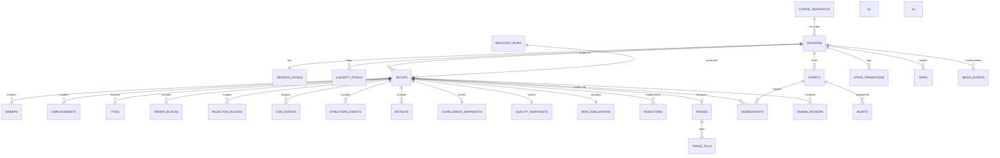

# DATABASE SCHEMA

Deliverable **(5)**. Status: PROPOSED.

Engine: **PostgreSQL 16** in production, **SQLite** for local research/tests
(the repository layer abstracts the difference; no vendor-specific SQL in
engines). Times are `timestamptz` stored in **UTC**; every table that has a
session context also stores `session_date` (ET calendar date) for querying.

Design rules:
1. **Append-only where it matters.** `events`, `state_transitions`, `alerts`,
   `rejections`, `trade_fills` are never updated, only inserted.
2. **Every row is reproducible.** Anything derived carries `config_hash`.
3. **Nullable ≠ false.** Order-flow columns are nullable and paired with an
   `*_availability` enum so "unavailable" is never stored as `false`.
4. **Foreign keys everywhere**, with `ON DELETE RESTRICT` — the archive is
   evidence and must not cascade away.

---

## 1. Entity relationship overview



---

## 2. Core tables

### `config_snapshots`
| Column | Type | Notes |
|---|---|---|
| `config_hash` | `text` PK | sha256 of canonical resolved config JSON |
| `param_version` | `text` | e.g. `0.1.0-proposed` |
| `config_json` | `jsonb` | fully resolved, secrets excluded |
| `created_at` | `timestamptz` | |

### `sessions`
| Column | Type | Notes |
|---|---|---|
| `session_id` | `text` PK | `2026-09-05-NQ` |
| `session_date` | `date` | ET calendar date |
| `symbol` | `text` | `NQ` / `MNQ` |
| `contract` | `text` | e.g. `NQZ2026` |
| `mode` | `enum` | `live` \| `shadow` \| `backtest` |
| `config_hash` | `text` FK | |
| `tz` | `text` | `America/New_York` |
| `is_half_day` | `bool` | |
| `is_roll_day` | `bool` | |
| `orb_high` `orb_low` `orb_range` | `numeric(12,2)` | null until 08:15 lock |
| `orb_locked_at` | `timestamptz` | immutable once set |
| `orb_status` | `enum` | `LIVE` \| `STAND_DOWN_SMALL` \| `STAND_DOWN_LARGE` |
| `bias` | `enum` | `BULLISH`\|`BEARISH`\|`NEUTRAL` |
| `bias_score` | `smallint` | −100..100 |
| `final_state` | `text` | terminal state |
| `trade_count` | `smallint` | |
| `realized_pnl_usd` | `numeric(12,2)` | |
| `realized_r` | `numeric(8,3)` | |
| `day_done_reason` | `text` | |
| `created_at` `closed_at` | `timestamptz` | |

Constraint: `orb_high/orb_low` are protected by a trigger that raises on UPDATE
after `orb_locked_at IS NOT NULL`. The immutability rule is enforced by the
database, not just by application code.

### `session_levels`
One row per session. Columns: `pdh, pdl, pdo, pdc, onh, onl, on_range,
midnight_open, daily_open, open_0830, open_0930, equilibrium, adr, atr_daily`,
each `numeric(12,2)` plus `*_available_at timestamptz` for the two intraday
opens. Also `htf_structure enum`, `htf_computed_at`.

### `bars` (replay tape)
`(session_id, symbol, tf, bar_time)` PK · `open, high, low, close numeric(12,2)`
· `volume bigint` · `source text` · `ingested_at`. Stores the execution-TF bars
for the tracked windows only (roughly 07:00–12:00 ET), which is what replay
needs without warehousing the whole market.

### `news_events`
`news_id` PK · `session_date` · `release_time timestamptz` · `title` ·
`impact enum` · `country` · `actual/forecast/previous text` · `source` ·
`available_at timestamptz` (used by the anti-lookahead loader) · `is_blacklisted`.

---

## 3. Structure tables

### `liquidity_pools`
`pool_id` PK · `session_id` FK · `kind enum(PDH…EQL)` · `side enum(BUY_SIDE,
SELL_SIDE)` · `level numeric` · `strength smallint` · `member_count smallint` ·
`created_at` · `state enum(IDENTIFIED, SWEPT, RECLAIMED, FAILED)` ·
`state_changed_at` · `swept_by_setup_id` nullable FK.

### `sweeps`
`sweep_id` PK · `setup_id` FK · `pool_id` FK · `sweep_bar_time` ·
`penetration_pts numeric` · `wick_ratio numeric` · `reclaimed bool` ·
`reclaim_bar_time` · `reclaim_bars smallint` · `close_back bool` ·
`direction enum` · `qualified bool` · `reasons jsonb`.

### `displacements`
`displacement_id` PK · `setup_id` FK · `start_bar_time` `end_bar_time` ·
`direction` · `score smallint` · `classification enum(NONE,WEAK,QUALIFIED,STRONG)`
· `leg_move`, `atr_ratio`, `body_ratio`, `consistency`, `close_location`,
`opp_wick_ratio` `numeric` · `components jsonb` (per-component contributions —
this is what makes the score explainable) · `has_bos bool` · `has_fvg bool`.

### `fvgs`
`fvg_id` PK · `session_id`, `setup_id` nullable · `tf` · `direction` ·
`gap_low`, `gap_high`, `midpoint`, `size` `numeric` · `created_bar_time` ·
`state enum(CREATED,ACTIVE,PARTIALLY_MITIGATED,FULLY_MITIGATED,INVALIDATED)` ·
`fill_pct numeric` · `first_touch_at` · `invalidated_at` · `from_displacement bool`.

### `order_blocks`
`ob_id` PK · `session_id`, `setup_id` nullable · `direction` · `zone_low`,
`zone_high`, `midpoint` · `origin_bar_time` · `zone_mode text` ·
`has_displacement`, `has_fvg`, `has_bos`, `unmitigated` `bool` ·
`quality numeric` · `mitigation_count smallint` · `status enum` .

### `rejection_blocks`
`rb_id` PK · `setup_id` FK · `direction` · `extreme numeric` ·
`body_boundary numeric` · `penetration_pts` · `wick_pct` · `reclaimed bool` ·
`bar_time` · `status enum`.

### `cisd_events`
`cisd_id` PK · `setup_id` FK · `direction` · `ref_mode text` ·
`ref_price numeric` · `ref_leg_start_bar`, `ref_leg_end_bar` ·
`confirm_bar_time` · `confirm_close numeric` · `body_atr numeric` ·
`bars_after_sweep smallint` · `qualified bool`.

### `structure_events`
`structure_id` PK · `session_id`, `setup_id` nullable · `type enum(BOS,MSS)` ·
`direction` · `broken_pivot_price` · `broken_pivot_bar_time` ·
`confirm_bar_time` · `published_at` (pivot-lag aware) · `prevailing_trend`.

### `retests`
`retest_id` PK · `setup_id` FK · `zone_type enum(FVG_MID,FVG_EDGE,OB,RB,ORB)` ·
`zone_ref_id text` · `zone_low`, `zone_high` · `first_touch_at` ·
`bars_since_displacement smallint` · `mfe_before_retest_r numeric` ·
`state enum(WAITING,DETECTED,ACTIVE,ENTRY_ZONE_TOUCHED,ENTRY_QUALIFIED,FAILED)` ·
`failed_reason text`.

---

## 4. Qualification and decision tables

### `setups`
| Column | Type | Notes |
|---|---|---|
| `setup_id` | `text` PK | `2026-09-05-NQ-SETUP001` — permanent, never reused |
| `session_id` | `text` FK | |
| `sequence_no` | `smallint` | 1,2,3… within the session |
| `setup_type` | `enum` | `CONTINUATION`\|`NEWS_REVERSAL`\|`UNCLASSIFIED` |
| `direction` | `enum` | `LONG`\|`SHORT` |
| `opened_at` | `timestamptz` | at first qualified sweep |
| `closed_at` | `timestamptz` | |
| `outcome` | `enum` | `INVALIDATED`\|`NO_TRADE`\|`TRADED`\|`EXPIRED` |
| `final_state` | `text` | furthest state reached |
| `max_milestone` | `smallint` | 1–17 |
| `confluence_count` | `smallint` | |
| `quality_score` | `smallint` | |
| `config_hash` | `text` FK | |
| `backtest_run_id` | `uuid` FK nullable | null ⇒ live/shadow |

### `confluence_snapshots`
`setup_id` PK/FK · one boolean column per factor
(`f01_sweep … f12_clean_path`) · plus `f10_availability`, `f11_availability`
`enum(MEASURED, UNAVAILABLE)` · `total smallint` · `evaluated_at` ·
`detail jsonb` (why each factor was true/false — the explainability payload).

### `quality_snapshots`
`setup_id` PK/FK · nine component scores `numeric(6,2)` · `total smallint` ·
`band enum` · `weights jsonb` (the weights actually used) · `evaluated_at`.

### `risk_evaluations`
`setup_id` PK/FK · `entry_ref numeric` · `stop numeric` · `stop_distance` ·
`stop_source text` (which swept extreme) · `orb_fraction numeric` ·
`valid bool` · `invalid_reason text` · `risk_per_contract numeric` ·
`max_contracts smallint` · `actual_risk_usd numeric` · `size_multiplier numeric`
· `tp1`, `tp2`, `tp2_source text` · `path_status enum(PATH_CLEAR,OBSTRUCTED)` ·
`path_severity numeric` · `path_detail jsonb`.

### `rejections` (the reason ledger)
`rejection_id` PK · `session_id` · `setup_id` nullable · `at timestamptz` ·
`stage text` (which engine) · `code text` (canonical reason code) ·
`message text` (human sentence) · `context jsonb`.
This is the table that answers "what is missing?" and "why no trade today?".

---

## 5. Execution tables

### `trades`
`trade_id` PK · `setup_id` FK unique · `session_id` · `direction` ·
`mode enum(shadow, live, backtest)` · `planned_entry`, `planned_stop`,
`planned_tp1`, `planned_tp2` · `contracts smallint` · `risk_usd` ·
`entry_time`, `entry_price` · `exit_time`, `exit_price` ·
`result enum(WIN,LOSS,BREAKEVEN,TIME_STOP,SCRATCH)` · `r_multiple numeric(8,3)` ·
`pnl_usd numeric` · `commission_usd`, `slippage_pts` ·
`mae_r`, `mfe_r numeric` · `tp1_hit bool`, `tp1_time` · `tp2_hit bool` ·
`exit_reason text` · `is_second_trade bool`.

### `trade_fills`
`fill_id` PK · `trade_id` FK · `at` · `kind enum(ENTRY,TP1,TP2,STOP,TRAIL,TIME)` ·
`price`, `qty` · `assumed bool` (true in shadow/backtest) · `slippage_pts` ·
`model text` (which fill model produced it).

---

## 6. Event, alert, evidence tables

### `events`
| Column | Type | Notes |
|---|---|---|
| `event_id` | `text` PK | see `EVENT_SCHEMA.md` |
| `session_id` `setup_id` | FK | setup nullable for session-level events |
| `sequence` | `bigint` | monotonic per session |
| `milestone` | `smallint` | 1–17, null for non-milestone events |
| `type` | `text` | `LIQUIDITY_SWEPT`, `DISPLACEMENT`, … |
| `at` | `timestamptz` | bar close time, not wall clock |
| `bar_time` | `timestamptz` | |
| `symbol` `state` `direction` | `text` | |
| `price` | `numeric` | |
| `reason` | `text` | human sentence |
| `confluence` `quality_score` | `smallint` | |
| `payload` | `jsonb` | full engine vector |
| `source` | `enum` | `python_engine` \| `pine_webhook` |
| `received_at` | `timestamptz` | |
Unique index on `(session_id, sequence)`; unique on `event_id` (idempotency).

### `state_transitions`
`id` PK · `session_id` · `setup_id` nullable · `from_state`, `to_state` ·
`at` · `trigger_event_id` FK · `guard_detail jsonb` · `duration_in_prev_ms`.

### `alerts`
`alert_id` PK · `event_id` FK · `signal_id text UNIQUE` (the dedupe key, e.g.
`2026-09-05-NQ-SETUP001-LIQUIDITY`) · `channel enum(telegram, log, webhook)` ·
`status enum(QUEUED,SENT,FAILED,SUPPRESSED)` · `suppressed_reason` ·
`sent_at` · `telegram_message_id` · `body text` · `attempts smallint`.

### `screenshots`
`screenshot_id` PK · `session_id`, `setup_id` nullable, `event_id` nullable ·
`stage enum` (A–Q) · `filename text` (`YYYY-MM-DD_SYMBOL_SETUPID_EVENT_HHMMSS.png`)
· `storage_path text` · `sha256 text` · `bytes bigint` · `captured_at` ·
`backend enum(server_render, headless_tv)` · `annotations jsonb` ·
`context_snapshot jsonb` (every value from the SCREENSHOT REQUIREMENTS list, so
the image is reconstructible even if the file is lost).

### `human_reviews`
`review_id` PK · `setup_id` FK · `reviewer text` · `verdict enum(PASS,FAIL,UNSURE)`
· `human_setup_type text` · `human_direction text` · `notes text` ·
`disagreement_tags text[]` · `created_at`.
Used to compute algorithm-vs-human agreement per engine.

---

## 7. Research tables

### `backtest_runs`
`run_id uuid` PK · `started_at`, `finished_at` · `config_hash` FK ·
`code_git_sha text` · `date_from`, `date_to` · `symbol` · `data_source` ·
`fill_model` · `sessions_count`, `setups_count`, `trades_count` ·
`metrics jsonb` · `notes text` · `is_walk_forward bool` · `fold_id`.

### `backtest_metrics`
Long-form `(run_id, dimension, bucket, metric, value)` so the analysis
dimensions (ORB size band, weekday, time bucket, setup type, confluence count,
quality band, bias, sweep source) are queryable without schema changes.

### `orderflow_snapshots` (nullable, gated)
`(session_id, bar_time)` PK · `delta numeric` · `cvd numeric` ·
`bid_volume`, `ask_volume bigint` · `availability enum(MEASURED, UNAVAILABLE)` ·
`provider text`. Rows are only written by a real provider; the `null` provider
writes nothing at all, so an empty table is unambiguous.

---

## 8. Key indexes

```sql
CREATE INDEX ON events (session_id, sequence);
CREATE INDEX ON events (setup_id, milestone);
CREATE INDEX ON setups (session_date, setup_type, outcome);
CREATE INDEX ON setups (quality_score, confluence_count);
CREATE INDEX ON trades (session_date, result);
CREATE INDEX ON rejections (code, session_date);
CREATE INDEX ON liquidity_pools (session_id, state);
CREATE UNIQUE INDEX ON alerts (signal_id);
CREATE INDEX ON bars (session_id, tf, bar_time);
```

## 9. Retention and integrity

* `bars`, `events`, `setups`, `trades`, `screenshots` — retained indefinitely
  (this is the archive).
* Nightly job verifies: every `setups` row reaches a terminal `outcome`; every
  `events.sequence` run is gap-free; every `screenshots.sha256` still matches
  the stored object; every session has a `config_hash` that exists.
* Any integrity failure raises a Telegram operational alert (separate channel
  from trading alerts).
