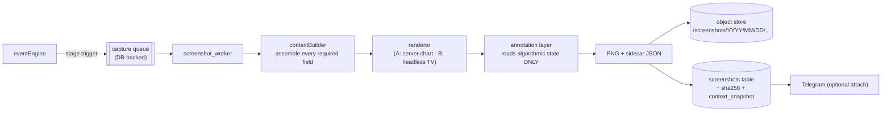

# SCREENSHOT / EVIDENCE ARCHITECTURE

Deliverable **(7)**. Status: PROPOSED — **contains blocking question B7.**

---

## 1. The honest problem statement

TradingView has no supported API for programmatic chart screenshots, and
automating a logged-in TradingView session with a headless browser is fragile
and may conflict with their terms of service. I am not going to build that
quietly and let you discover the consequences later.

Three options:

| | Approach | Fidelity | Reproducible | Robustness | ToS exposure |
|---|---|---|---|---|---|
| **A** | **Server-rendered chart** from our own bars + our own annotation layer | Our design, not your TV theme | **Yes — regenerable forever** | High | None |
| **B** | Headless browser capture of your TradingView chart | Pixel-identical to what you see | No — cannot be regenerated later | Low (breaks on any UI change) | Requires your review of TradingView's terms |
| **C** | Both: A as the archival record, B as an optional convenience layer | Both | A regenerable, B not | Medium | Same as B for the optional half |

**Recommendation: A as the default and the archival source of truth.**
An evidence archive whose images cannot be regenerated in two years is not an
archive. Option C is available if you want the familiar view as well, once you
have satisfied yourself about the terms.

The rest of this document specifies A, with B described as a pluggable backend.

---

## 2. Architecture



Capture is **asynchronous and never blocking**. A failed capture raises an
`OPS_ALERT` and writes a `screenshots` row with `status = FAILED`; it never
delays or alters a trading decision.

---

## 3. Capture stages (A–Q per specification)

| Code | Stage | Trigger event | Directory |
|---|---|---|---|
| A | Pre-market | `PREMARKET_READY` | `premarket/` |
| B | ORB locked | `ORB_LOCKED` | `context/` |
| C | Liquidity identified | `LIQUIDITY_IDENTIFIED` | `context/` |
| D | Liquidity swept | `LIQUIDITY_SWEPT` | `setups/` |
| E | Abnormal wick | `ABNORMAL_WICK` | `setups/` |
| F | Displacement | `DISPLACEMENT` | `setups/` |
| G | 3+ confluence | confluence crosses 3 | `confluence/` |
| H | 5+ confluence | crosses 5 | `confluence/` |
| I | 7+ confluence | crosses 7 | `confluence/` |
| J | 10+ confluence | crosses 10 | `confluence/` |
| K | Retest | `RETEST_DETECTED` | `setups/` |
| L | Entry ready | `ENTRY_READY` | `entries/` |
| M | Trade entry | `TRADE_ENTRY` | `entries/` |
| N | TP1 | `TP1` | `exits/` |
| O | TP2 / exit | `EXIT` | `exits/` |
| P | Invalidation | `INVALIDATION` | `invalidations/` |
| Q | Day complete | `DAY_DONE` | `context/` |

Confluence-crossing stages fire **once per threshold per setup** (the crossing
is an edge, not a level), so a setup oscillating at 5 confluences produces one
image, not twenty.

---

## 4. Required content (every capture)

Rendered on the chart or in the info panel — all of it, every time:

```
Symbol · Contract · Date · Time (ET) · Timeframe · Current price
ORB high/low/size/status · Equilibrium
PDH · PDL · ONH · ONL · Midnight Open · Daily Open · 08:30 Open · 09:30 Open
Liquidity pools + state · Sweep marker · Displacement leg
FVG zones + fill % · Order blocks · Rejection blocks · CISD reference line
Daily bias + score · Premium/Discount location
Entry · Stop · TP1 · TP2 (when defined)
Confluence X/12 with the factor list · Quality score + band
Setup type · Setup ID · Current state · Next condition
Mode (SHADOW/LIVE/BACKTEST) · config_hash (short) · param_version
```

Every one of these values is also written to `screenshots.context_snapshot`
(JSON sidecar). **The image is the convenience; the JSON is the evidence.**
If a PNG is ever lost or a renderer changes, the setup is still fully
reconstructible.

---

## 5. Annotation rules

1. Annotations render **only** algorithmic state. The renderer receives an
   immutable `SetupContext` and has no access to engines — it cannot compute,
   infer, or beautify anything.
2. Labels use the canonical vocabulary: `LIQUIDITY`, `SWEEP`, `DISPLACEMENT`,
   `FVG`, `ORDER BLOCK`, `REJECTION`, `CISD`, `RETEST`, `ENTRY`, `SL`, `TP1`,
   `TP2`, `TARGET`.
3. Unavailable data is drawn as `N/A`, never omitted and never inferred —
   `ABSORPTION: ORDER FLOW DATA UNAVAILABLE` appears on the image.
4. Nothing "future" is drawn: a capture at stage F cannot show the retest that
   later happened. The renderer is bound to the same `CausalView` cutoff as the
   event, which makes the archive's images honest for review.
5. Visual identity: institutional. Neutral dark or light ground, one accent for
   bullish, one for bearish, one for neutral zones, thin lines, monospaced
   numerics. No bulls, bears, rockets, dollar signs, or neon.

---

## 6. Naming and storage

```
YYYY-MM-DD_SYMBOL_SETUPID_EVENT_HHMMSS.png
2026-09-05_NQ_SETUP001_LIQUIDITY_083125.png
```

Session-scoped captures use `SESSION` in place of the setup id:
`2026-09-05_NQ_SESSION_PREMARKET_074500.png`.

```
/screenshots/
  2026/
    09/
      05/
        premarket/
        context/
        setups/
        confluence/
        entries/
        exits/
        invalidations/
        _sidecars/          JSON context snapshots, same basename
```

* Local filesystem in development; S3-compatible object store in production
  with server-side encryption and versioning.
* `sha256` recorded at write; a nightly integrity job re-verifies.
* Retention: 5 years default (`screenshot.retention_days`); the sidecar JSON is
  retained indefinitely because it is small and it is the real record.

---

## 7. Renderer backends

```
ScreenshotBackend (ABC)
  ├── ServerChartRenderer   default. Deterministic. Inputs: bars + SetupContext.
  ├── HeadlessTVRenderer    optional. Requires explicit enablement + your ToS review.
  └── NullRenderer          tests / CI. Writes the sidecar JSON only.
```

`ServerChartRenderer` draws from the same `bars` rows used for replay, so an
archived image can be regenerated bit-for-bit years later by re-running the
renderer at the same `config_hash` and code SHA. That property is why it is the
default.

---

## 8. Cost and volume

Roughly 8–17 images per active session at ~250 KB each ≈ 4 MB/day ≈ 1 GB/year.
Storage cost is negligible; the constraint is discipline about what is worth
capturing, which the stage list already encodes.
