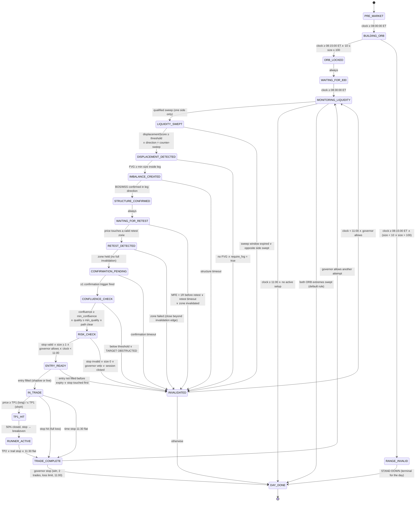

# NORTHSTAR STATE MACHINE

Deliverable **(3) state-machine diagram**. Status: PROPOSED.

The machine is **one instance per session per symbol**. Setup-scoped substates
(`LIQUIDITY_SWEPT` → `TRADE_COMPLETE`) belong to the *active setup*; when a
setup invalidates, the machine returns to `MONITORING_LIQUIDITY` and a **new
`setup_id`** is minted on the next qualifying sweep. Setup IDs are never reused.

---

## 1. Diagram

---

## 2. Transition table

`G` = guard. All guards are evaluated on **closed bars only**. Every rejected
guard writes a `rejection` row with a reason code.

| # | From | Event / guard | To | Emits | Notes |
|---|---|---|---|---|---|
| T01 | `PRE_MARKET` | levels + bias computed | `PRE_MARKET` | `01_PREMARKET_READY` | self-transition, once |
| T02 | `PRE_MARKET` | `t ≥ 08:00:00` | `BUILDING_ORB` | — | |
| T03 | `BUILDING_ORB` | bar close in window | `BUILDING_ORB` | — | provisional high/low, not published |
| T04 | `BUILDING_ORB` | `t ≥ 08:15:00 ∧ 10 ≤ R ≤ 100` | `ORB_LOCKED` | `02_ORB_LOCKED` | ORB immutable from here |
| T05 | `BUILDING_ORB` | `t ≥ 08:15:00 ∧ (R<10 ∨ R>100)` | `RANGE_INVALID` | `02_ORB_LOCKED` (STAND DOWN) | reason `ORB_TOO_SMALL` / `ORB_TOO_LARGE` |
| T06 | `RANGE_INVALID` | always | `DAY_DONE` | `17_DAY_DONE` | still runs monitoring/logging in observe-only |
| T07 | `ORB_LOCKED` | liquidity pools mapped | `WAITING_FOR_830` | `03_LIQUIDITY_IDENTIFIED` | |
| T08 | `WAITING_FOR_830` | `t ≥ 08:30:00` | `MONITORING_LIQUIDITY` | — | catalyst flag set if news window |
| T09 | `MONITORING_LIQUIDITY` | qualified sweep, one side | `LIQUIDITY_SWEPT` | `04_LIQUIDITY_SWEPT` | mints `setup_id`; `05_ABNORMAL_WICK` if wick qualifies |
| T10 | `MONITORING_LIQUIDITY` | both ORB extremes swept | `DAY_DONE` | `17_DAY_DONE` | reason `BOTH_SIDES_SWEPT`; overridable by config |
| T11 | `MONITORING_LIQUIDITY` | `t ≥ 11:00` | `DAY_DONE` | `17_DAY_DONE` | reason `SESSION_CLOSED` |
| T12 | `LIQUIDITY_SWEPT` | displacement qualified, counter-sweep | `DISPLACEMENT_DETECTED` | `06_DISPLACEMENT` | records score + direction |
| T13 | `LIQUIDITY_SWEPT` | `Δt > sweep_to_displacement_max` | `INVALIDATED` | `INVALIDATION` | reason `NO_DISPLACEMENT` |
| T14 | `DISPLACEMENT_DETECTED` | FVG ≥ `fvg_min_points` in leg | `IMBALANCE_CREATED` | `07_FVG_CREATED` | |
| T15 | `DISPLACEMENT_DETECTED` | no FVG ∧ `require_fvg` | `INVALIDATED` | `INVALIDATION` | reason `NO_FVG` |
| T16 | `IMBALANCE_CREATED` | BOS/MSS confirmed | `STRUCTURE_CONFIRMED` | `08_STRUCTURE_CONFIRMED` | pivot-confirmed, delayed, no repaint |
| T17 | `IMBALANCE_CREATED` | `Δt > structure_timeout` | `INVALIDATED` | `INVALIDATION` | reason `NO_STRUCTURE` |
| T18 | `STRUCTURE_CONFIRMED` | zones published | `WAITING_FOR_RETEST` | — | zone set frozen and stored |
| T19 | `WAITING_FOR_RETEST` | price touches zone | `RETEST_DETECTED` | `09_RETEST_DETECTED` | |
| T20 | `WAITING_FOR_RETEST` | `MFE > 1R` | `INVALIDATED` | `INVALIDATION` | reason `MOVED_1R_BEFORE_RETEST` |
| T21 | `WAITING_FOR_RETEST` | `Δt > retest_timeout` | `INVALIDATED` | `INVALIDATION` | reason `NO_RETEST` |
| T22 | `RETEST_DETECTED` | zone held on close | `CONFIRMATION_PENDING` | — | |
| T23 | `RETEST_DETECTED` | close beyond invalidation edge | `INVALIDATED` | `INVALIDATION` | reason `RETEST_FAILED` |
| T24 | `CONFIRMATION_PENDING` | ≥1 trigger (CISD / structure / rejection) | `CONFLUENCE_CHECK` | `10_CONFIRMATION` | |
| T25 | `CONFIRMATION_PENDING` | `Δt > confirmation_timeout` | `INVALIDATED` | `INVALIDATION` | reason `NO_CONFIRMATION` |
| T26 | `CONFLUENCE_CHECK` | `conf ≥ min ∧ quality ≥ min ∧ path clear` | `RISK_CHECK` | `11_CONFLUENCE_MET` | |
| T27 | `CONFLUENCE_CHECK` | `conf < min` | `INVALIDATED` | `INVALIDATION` | reason `CONFLUENCE_BELOW_THRESHOLD` |
| T28 | `CONFLUENCE_CHECK` | obstruction found | `INVALIDATED` | `INVALIDATION` | reason `TARGET_OBSTRUCTED` |
| T29 | `RISK_CHECK` | stop valid ∧ contracts ≥ 1 ∧ governor ok | `ENTRY_READY` | `12_RISK_VALIDATED`, `13_ENTRY_READY` | full `TradePlan` persisted |
| T30 | `RISK_CHECK` | stop out of `[10,30]` or `> R_orb/3` | `INVALIDATED` | `INVALIDATION` | reason `STOP_INVALID` |
| T31 | `RISK_CHECK` | governor veto | `INVALIDATED` | `INVALIDATION` | reason `MAX_TRADES` / `DAILY_LOSS_LIMIT` / `SESSION_CLOSED` |
| T32 | `ENTRY_READY` | fill | `IN_TRADE` | `TRADE_ENTRY` | shadow fill in shadow mode |
| T33 | `ENTRY_READY` | `Δt > entry_ttl` ∨ stop touched first | `INVALIDATED` | `INVALIDATION` | reason `ENTRY_EXPIRED` / `STOP_FIRST` |
| T34 | `IN_TRADE` | TP1 touched | `TP1_HIT` | `14_TP1` | close 50%, stop → BE |
| T35 | `IN_TRADE` | stop touched | `TRADE_COMPLETE` | `16_EXIT` | result `LOSS`, R = −1 |
| T36 | `TP1_HIT` | always | `RUNNER_ACTIVE` | `15_RUNNER` | |
| T37 | `RUNNER_ACTIVE` | TP2 ∨ trail ∨ 11:30 | `TRADE_COMPLETE` | `16_EXIT` | |
| T38 | `TRADE_COMPLETE` | governor allows attempt 2 | `MONITORING_LIQUIDITY` | — | size halved on second attempt |
| T39 | `TRADE_COMPLETE` | governor stops | `DAY_DONE` | `17_DAY_DONE` | |
| T40 | `INVALIDATED` | `t < 11:00 ∧ governor ok` | `MONITORING_LIQUIDITY` | — | setup closed with outcome `INVALIDATED` |
| T41 | any | `t ≥ 11:30` ∧ position open | `TRADE_COMPLETE` | `16_EXIT` (`TIME_STOP`) | hard flat |
| T42 | any | fatal data gap / feed loss | `INVALIDATED` | `INVALIDATION` (`DATA_INTEGRITY`) | never guesses through a gap |

---

## 3. Guard reference

| Guard | Definition |
|---|---|
| `R` | `orb_high − orb_low`, points |
| `1R` | `abs(entry − stop)` for the *proposed* plan at the time of measurement |
| `MFE` | max favourable excursion from the displacement leg's origin, in R |
| `counter-sweep` | displacement direction opposite to the sweep direction (low swept → bullish displacement) |
| `governor ok` | `trades_today < max_trades ∧ realised_loss > −daily_loss_limit ∧ not day_done ∧ t < 11:00` |
| `catalyst` | a high-impact news release inside `news_window` of 08:30 |

---

## 4. Invariants (asserted at runtime and in tests)

1. `ORB_LOCKED` is reached at most once per session; `orb_high`/`orb_low` never
   change after 08:15:00 ET.
2. No transition into `ENTRY_READY` without a persisted, complete `TradePlan`.
3. No transition into `IN_TRADE` from any state other than `ENTRY_READY`.
4. `DAY_DONE` is terminal; no transition leaves it.
5. Every `INVALIDATED` carries exactly one primary reason code (plus optional
   secondary codes).
6. Every state change writes exactly one `state_transitions` row.
7. Events are strictly increasing in `sequence` within a session.
8. A `setup_id` progresses monotonically through milestone ordinals; it can stop
   early but never move backwards.
