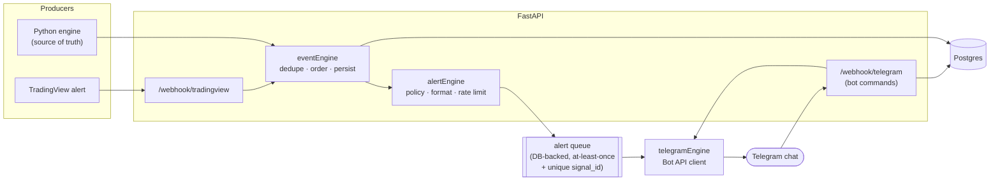

# TELEGRAM INTELLIGENCE ARCHITECTURE

Deliverable **(6)**. Status: PROPOSED.

Telegram is a **market intelligence assistant**, not a signal spammer. It speaks
only on meaningful state changes, and it can always answer a question on demand.

---

## 1. Architecture



**Delivery mode.** Webhook (`setWebhook`) rather than long polling: one public
TLS endpoint already exists for TradingView, and webhooks avoid a persistent
poller. Telegram's `secret_token` header is verified on every request.

---

## 2. Alert policy — what earns a message

A message is sent **only** when all of these hold:

1. The event is a milestone or an `INVALIDATION` / `DAY_DONE`.
2. Its `signal_id` has never been sent (unique index enforces this).
3. It represents a **state change**, not a re-evaluation of the same state.
4. It passes the per-class policy below.
5. The rate limiter (default 10/min) has capacity; otherwise it is coalesced.

| Event class | Alerted? | Notes |
|---|---|---|
| `PREMARKET_READY` | Yes — Morning Brief | once, ≤ 08:00 ET |
| `ORB_LOCKED` | Yes | includes LIVE / STAND DOWN verdict |
| `LIQUIDITY_IDENTIFIED` | No by default | folded into the ORB message |
| `LIQUIDITY_SWEPT` | Yes | the first genuinely actionable event |
| `ABNORMAL_WICK` | No standalone | included in the sweep message |
| `DISPLACEMENT` | Yes | |
| `FVG_CREATED` | No standalone | included in the displacement message |
| `STRUCTURE_CONFIRMED` | No standalone | included in displacement/retest |
| `RETEST_DETECTED` | Yes | |
| `CONFIRMATION` | No standalone | included in retest message |
| `CONFLUENCE_MET` | No standalone | included in retest / entry |
| `RISK_VALIDATED` | No standalone | included in entry |
| `ENTRY_READY` | Yes ★ | the headline message |
| `TP1` `RUNNER` `EXIT` | Yes | trade lifecycle |
| `INVALIDATION` | Yes | **always** — knowing why a setup died matters |
| `DAY_DONE` | Yes | end-of-day summary |
| `REJECTION` | No | ledger only; available via `/checklist` |
| `OPS_ALERT` | Yes, separate channel | data gaps, parity breaks, failures |

Net effect on a busy day: roughly **6–10 messages**, not dozens.

---

## 3. Message templates

Formatting: `MarkdownV2`, no emoji beyond a single `★` on ENTRY READY, no
colour, no hype. All numbers formatted to the instrument's tick precision.

### 3.1 Morning brief (automatic, before 08:00 ET)

```
NORTHSTAR CAPITAL™
NQ MORNING BRIEF

DATE:              2026-09-05 (Friday)
DAILY BIAS:        BULLISH
BIAS SCORE:        +68

PDH:               23512.75
PDL:               23388.25
ON HIGH:           23474.00
ON LOW:            23401.50
MIDNIGHT OPEN:     23440.25
DAILY OPEN:        23428.00

BULLISH LIQUIDITY: ONH 23474.00 · PDH 23512.75
BEARISH LIQUIDITY: ONL 23401.50 · PDL 23388.25
MAJOR FVG:         23455.00–23461.50 (4H, unmitigated)
MAJOR OB:          23412.00–23421.75 (4H, bullish, unmitigated)

HIGH IMPACT NEWS:  YES — 08:30 ET Nonfarm Payrolls

MODEL STATUS:      WAITING FOR ORB
NEXT:              WAIT FOR MARKET REACTION
```

### 3.2 ORB locked

```
NORTHSTAR CAPITAL™
ORB LOCKED · NQ

RANGE:   23427.25 – 23470.50
SIZE:    43.25 POINTS
STATUS:  LIVE
EQ:      23448.88

NEXT:    08:30 REACTION — MONITORING LIQUIDITY
```

STAND DOWN variant states the size, the bound it violated, and
`NO TRADE TODAY — RANGE INVALID`.

### 3.3 Liquidity event

```
NORTHSTAR CAPITAL™
LIQUIDITY EVENT · NQ

LEVEL:          ORB LOW 23427.25
SWEEP:          CONFIRMED (6.75 pts penetration)
RECLAIM:        YES (1 bar)
ABNORMAL WICK:  YES (62%)
OTHER SIDE:     NOT SWEPT

SETUP:          SETUP001
NEXT CONDITION: DISPLACEMENT
```

### 3.4 Displacement

```
NORTHSTAR CAPITAL™
DISPLACEMENT CONFIRMED · NQ

DIRECTION:  LONG
SCORE:      84/100 (STRONG)
STRUCTURE:  CONFIRMED (MSS)
FVG:        CREATED
FVG SIZE:   5.75

NEXT CONDITION: RETEST
```

### 3.5 Retest

```
NORTHSTAR CAPITAL™
RETEST DETECTED · NQ

ENTRY ZONE:   23453.50 – 23456.25
FVG MIDPOINT: 23454.88
ORDER BLOCK:  YES
REJECTION:    YES
CISD:         YES
CONFLUENCE:   6/12

NEXT: RISK VALIDATION
```

### 3.6 Entry ready

```
NORTHSTAR CAPITAL™
★ ENTRY READY ★ · NQ

SETUP:         NEWS REVERSAL
DIRECTION:     LONG
ENTRY:         23455.00
STOP:          23425.25
STOP DISTANCE: 29.75 POINTS
TP1:           23514.50  (2R, 50%)
TP2:           23574.00  (4R)
CONTRACTS:     1
RISK:          $595

CONFLUENCE:    7/12
QUALITY:       87/100  HIGH QUALITY
BIAS:          BULLISH +72
LOCATION:      DISCOUNT
SWEEP:         CONFIRMED
DISPLACEMENT:  CONFIRMED
RETEST:        CONFIRMED
PATH:          CLEAR

MODE:          SHADOW — NO ORDER PLACED
STATUS:        LONG READY
```

The `MODE:` line is mandatory and always present. In shadow mode it says so in
every entry message; there must never be ambiguity about whether something was
actually traded.

### 3.7 Invalidation

```
NORTHSTAR CAPITAL™
SETUP INVALIDATED · NQ · SETUP001

REASON:   MOVED 1R BEFORE RETEST
DETAIL:   Price travelled 1.4R from the displacement leg with no retest.
REACHED:  08 STRUCTURE CONFIRMED
STATE:    MONITORING LIQUIDITY

NEXT: NEW SWEEP REQUIRED
```

### 3.8 Day done

```
NORTHSTAR CAPITAL™
DAY COMPLETE · NQ · 2026-09-05

TRADES:     1 (1W / 0L)
RESULT:     +2.0R  ·  +$1,000
SETUPS:     3 observed, 2 invalidated
REASON:     FIRST TRADE WON — DAY DONE

NO FURTHER SIGNALS TODAY.
```

---

## 4. Commands

All commands are **read-only**. No command can modify configuration, place an
order, or change state. Unknown commands return `/help`.

| Command | Returns |
|---|---|
| `/status` | current state, next condition, elapsed time in state, what is missing |
| `/levels` | PDH/PDL/PDO/PDC, ONH/ONL, midnight/daily/08:30/09:30 opens, major FVG/OB |
| `/orb` | ORB high/low/size/status/equilibrium, lock time |
| `/bias` | bias, score, and the per-component contributions |
| `/checklist` | the full Northstar checklist with live ticks and the rejection ledger |
| `/setup` | the active setup: milestones reached, confluence detail, what is missing |
| `/risk` | proposed stop/size/risk, remaining daily risk, trades used |
| `/trades` | today's trades with R and P&L; `/trades 5` for the last 5 sessions |
| `/news` | today's high-impact releases and the catalyst window status |
| `/lastsignal` | the most recent alert, verbatim, with its `signal_id` |
| `/help` | this list |

Authorisation: the handler compares `message.chat.id` against `TELEGRAM_CHAT_ID`
and silently ignores everything else. Rate limit: 20 commands/min per chat.

---

## 5. Configuration and secrets

Environment variables only — never in code, never in the config YAML, never in
git:

```
TELEGRAM_BOT_TOKEN       from @BotFather
TELEGRAM_CHAT_ID         your private chat or channel id
TELEGRAM_WEBHOOK_SECRET  random 32+ bytes; sent as X-Telegram-Bot-Api-Secret-Token
TELEGRAM_OPS_CHAT_ID     optional, separate channel for operational alerts
WEBHOOK_SECRET           TradingView shared secret (separate value)
```

Setup steps (documented for Phase 24, not executed now):

1. Create the bot with @BotFather, store the token in the secret manager.
2. Send a message to the bot, read `chat.id` from `getUpdates`, store it.
3. `setWebhook` to `https://<host>/webhook/telegram` with `secret_token`.
4. `setMyCommands` with the eleven commands above.
5. Verify with a smoke test that a synthetic event produces exactly one message.

---

## 6. Failure behaviour

| Failure | Behaviour |
|---|---|
| Telegram API 429 | exponential backoff honouring `retry_after`; queue preserved |
| Telegram API 5xx | retry ×5 with backoff, then mark `FAILED` and raise `OPS_ALERT` |
| Network partition | events still persist to Postgres; alerts drain when connectivity returns; **stale alerts older than `stale_alert_max_age` (default 10 min) are downgraded to a summary rather than sent as if live** |
| Duplicate delivery attempt | blocked by the `signal_id` unique index |
| Bot token revoked | `OPS_ALERT` via log + health endpoint turns unhealthy |

The trading model never depends on Telegram. Telegram is an output; if it is
down, the archive is still complete and correct.
